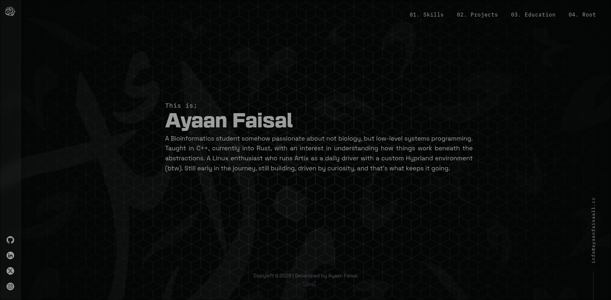

# Personal Portfolio Website
A dark-themed, minimalist personal portfolio website designed for developers. It features a sleek interface with a hexagonal grid background, custom typography, and a layout optimized for showcasing skills, projects, and educational background. 

## Screenshot


## Features
* Dark-Themed UI: A sleek, terminal-inspired aesthetic with a subtle background pattern.
* Minimalist Layout: Clean and straightforward navigation (Skills, Projects, Education, Root).
* Social Links: Integrated sidebar for GitHub, LinkedIn, X, and Instagram profiles.
* Responsive Design: Adapts smoothly to different screen sizes.

## Technologies Used
* HTML5 / CSS3

## Getting Started
To get a local copy up and running, follow these simple steps.

### Prerequisites
* A modern web browser
* node.js

### Installation
1. Clone the repo
``````bash
git clone https://github.com/your-username/ayaanfaisaall.cc
``````

2. Navigate to the directory
``````bash
cd ayaanfaisaall.cc/contents
``````

3. Start a development server
``````bash
npx live-server
``````

## Credits & Attribution
This design and codebase were created by [Ayaan Faisal](https://github.com/Ayaanfaisaall). 
If you choose to fork this repository, use this design, or adapt the code for your own personal website, I kindly ask that you give credit. You can do this by keeping a link to my GitHub profile in your website's footer or by adding a line in your project's README.md stating: "Design inspired by [Ayaan Faisal](https://github.com/Ayaanfaisaall)."

## License
Distributed under the MIT License. See LICENSE for more information.

## Contact
Ayaan Faisal - info@ayaanfaisaall.cc
